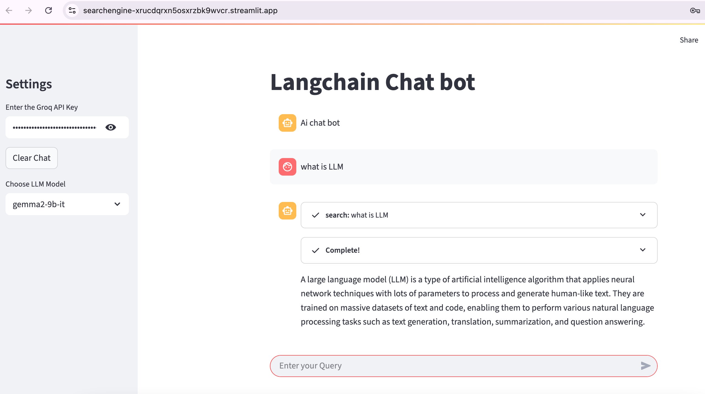
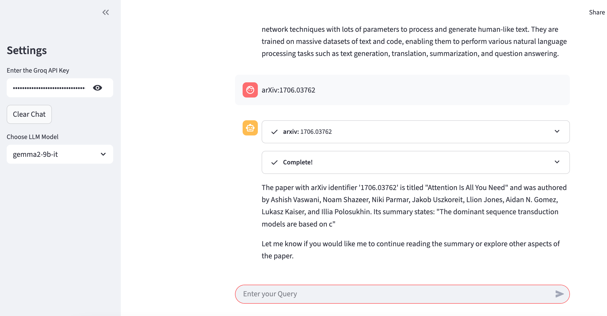

# Search_Engine

Live App on Streamlit Cloud
LangChain AI Chatbot with Groq, Arxiv & DuckDuckGo
This is a conversational AI chatbot built using Streamlit, LangChain, and Groq LLMs. It allows users to interact with powerful language models and integrates tools like Arxiv search and DuckDuckGo to enhance responses with real-time or research-based data.

🚀 Features
🔐 Secure LLM API key input via sidebar

🤖 Chat with models like gemma2-9b-it and llama3-8b-8192 via Groq

🧪 Research support via Arxiv search

🌐 Real-time search via DuckDuckGo

💬 Persistent conversation using Streamlit session state

♻️ Chat clear/reset functionality

| Tool         | Description                                 |
| ------------ | ------------------------------------------- |
| `Streamlit`  | Web interface for building interactive apps |
| `LangChain`  | Framework to connect LLMs with tools        |
| `Groq`       | High-speed LLM provider                     |
| `Arxiv`      | Scientific paper search                     |
| `DuckDuckGo` | Real-time web search                        |

📸 Preview
Search Engine 

